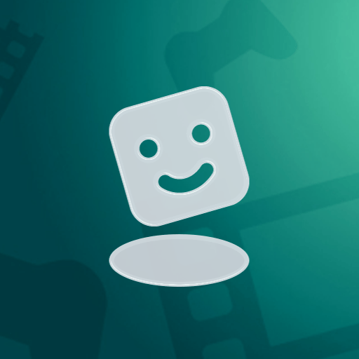
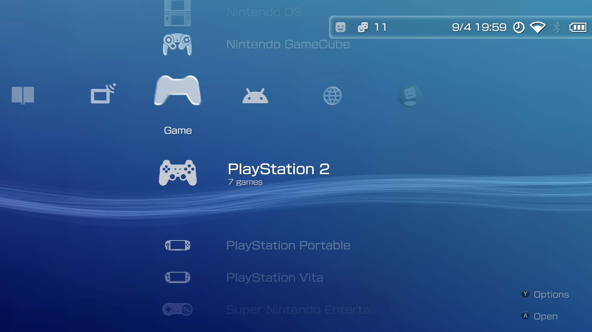
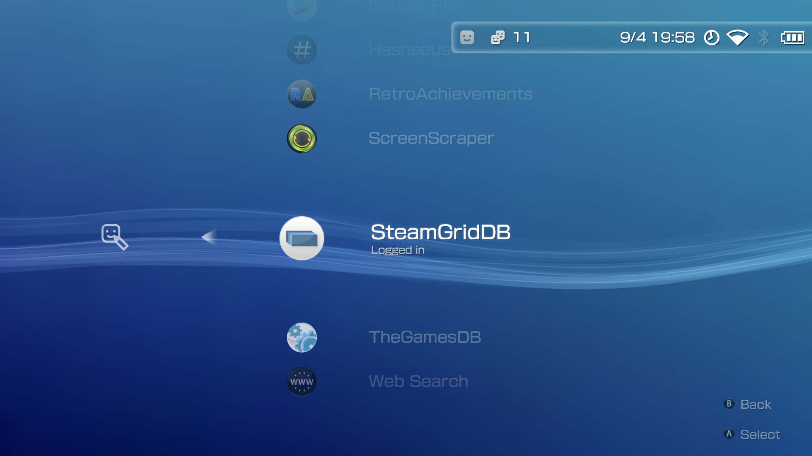
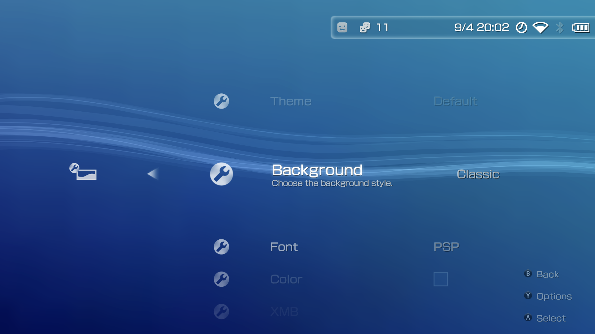
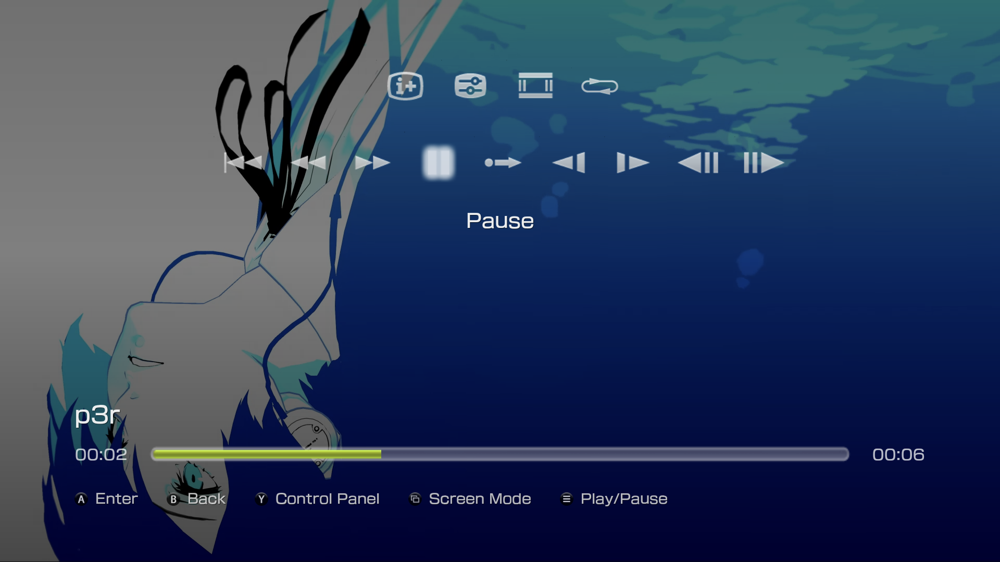
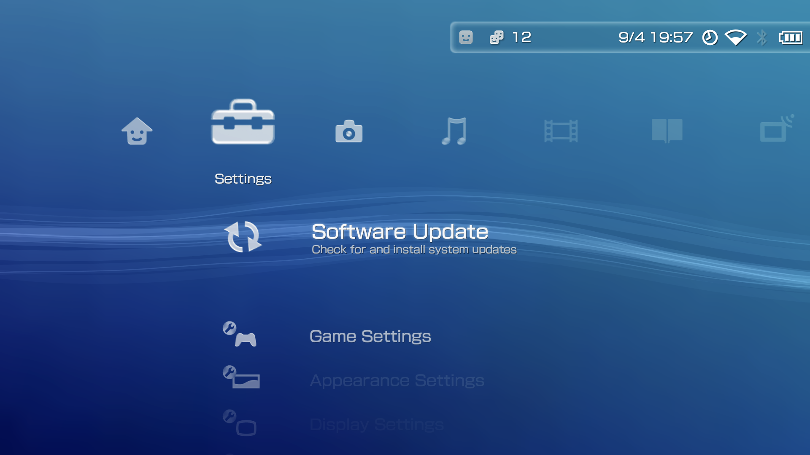

  

<h1 align="center">WaveLauncher</h1>

<i>Wave Launcher is an Android-based interface built around the design of the XrossMediaBar (XMB/PS3). It supports personal game libraries, rich metadata scraping, trophy tracking, multimedia playback, and an accurate recreation of XMB.</i>

  

  
  
  
  
  

  <a href="https://discord.gg/AFhRYrrUne">Discord</a> ·
  <a href="https://github.com/WaveLauncher/WaveLauncher/releases/latest">Download</a> ·
  <a href="https://apps.obtainium.imranr.dev/redirect?r=obtainium://add/https%3A%2F%2Fgithub.com%2FWaveLauncher%2FWaveLauncher">Obtainium</a> ·
  <a href="https://patreon.com/c/WaveLauncher/">Patreon</a> ·
  <a href="https://github.com/WaveLauncher/WaveLauncher/wiki">Wiki</a>

---

## About

WaveLauncher is an Android launcher for retro gaming handhelds. It focuses on gamepad-first navigation, a PlayStation 3 inspired interface, and first-class support for dual-screen devices. It scrapes game assets from many sources, tracks playtime and achievements, and lets you theme almost every surface of the interface.

> [!WARNING]
> WaveLauncher is a **frontend**, not an emulator. You still need to install and configure the emulators you want to use.

## Showcase

  
  

  
  

  
  

## Install & Updates

- **Manual APK (recommended).** Download the latest APK from the [Releases page](https://github.com/WaveLauncher/WaveLauncher/releases/latest) and install it. After the first install, the built-in in-app updater keeps WaveLauncher up to date and accepts Obtainium JSON imports.
- **Obtainium.** Tap the button below. Obtainium tracks releases from this repo and installs updates for you.

  

## Features

### Controller & Input
- Full gamepad support across the entire interface for controller-friendly navigation.
- Touch support (not fully finished).
- Xbox, PlayStation, and Nintendo controllers with type-specific UI and prompts.
- Customizable button layouts, including AB / XY swap.
- On-screen virtual controller for users without a physical pad or for phone-based control.
- Full on-screen keyboard with complete gamepad navigation in a PlayStation 3 style.

### Game Management & Organization
- Collections, recently played, and favorites.
- Automatic playtime tracking per game.
- Seamless switching between storages and microSD cards with hotswap support.
- Automatic game filtering that shows or hides titles based on the current card, with deduplication.
- Storage icon and label display, including autorun support for external storage.
- Fine-tuned emulator selection with per-platform and per-game overrides.

### Game Asset Scraping
- Multi-source scraping from SteamGridDB, ScreenScraper, RetroAchievements, Google Play, Web, and Hasheous.
- Direct asset scraping from real PSP, PS3, and PSP Minis sources.
- Extended asset scraping for donors, including NDS, 3DS, DSi, and DSiWare.
- Multi-language scraper support (English, German, French, Spanish, Italian, Portuguese, Dutch, Japanese, Korean, Russian, and Chinese).
- Independent app and scraper language settings. Unsupported scraper languages fall back to English safely.
- Free sound scraping for all platforms via direct game assets.
- Download custom jingles from GitHub for extra sound sources.
- User avatar customization with a one-time sync button for RetroAchievements and Discord.
- Image cropping tool in the scraper.

### Media (Video, Music, Photo)
- Full video player with complete controller support and audio / subtitle track selection (modernized PS3 style).
- Full music player with background playback (modernized PS3 style).
- Built-in photo gallery viewer with slideshow support (modernized PS3 style).
- Custom sound system, including coldboot sounds and custom UI effects.
- Individual volume controls for every sound element.

### Interface & Customization
- Personalized color schemes for the Wave wallpaper.
- Multiple wallpaper options and styles (Original, Classic, Custom, System).
- Adjustable wallpaper brightness with background brightness control.
- Font customization across the entire UI.
- Adjustable interface scaling for different screen sizes.
- Independent text size adjustment for better readability.
- Customizable status bar appearance and behavior.
- Choose your preferred date and time format for the status bar.
- PlayStation 3 toast overlays (unused for now, reserved for real-time trophies).
- Boot logo customization with styles from PS3, Wave, GammaOS, Android, AYN, Retroid Pocket, and Anbernic.

### System & Connectivity
- Built-in FTP support.
- Wave Portal: a web interface to change wallpaper, colors, and manage scraped games from a browser (experimental).
- Discord Rich Presence with a custom icon per game (uses the cover URL from the scraper).
- Automatic app updates with Obtainium JSON import via the built-in software updater.
- Built-in importer for the Obtainium emulation pack.
- Full support for dual-screen devices. Choose secondary apps that launch with your apps, pick which screen an app opens on, swap screens, and more.
- Per-screen orientation settings for flexible display control.
- Automatic single-screen mode when docked, with screen unswapping.

### Android Integration
- Reliable separation of Games, Emulators, and Apps in the Android section.
- Multi-language app support (English, German, French, Spanish, Italian, Portuguese, Turkish, Dutch, Japanese, Korean, Russian, and Chinese).
- Migration from other launchers (in development, planned after 1.0).

### Achievements & Progress
- Achievement tracking via RetroAchievements.
- Dusklight (Twilitrealm) achievements support.

### Setup & Configuration
- Quick first-run setup with an easy initial configuration process.
- Custom paths with existing file detection. On install you choose to delete or keep the found files.
- Easy game library configuration with a game directory setup step.

## Acknowledgments

WaveLauncher builds on the work of many people and services.

- Asset and metadata sources: [SteamGridDB](https://www.steamgriddb.com/), [ScreenScraper](https://www.screenscraper.fr/), [RetroAchievements](https://retroachievements.org/), [Hasheous](https://hasheous.org/), and Google Play.
- Inspiration from the wider retro launcher community.
- Thanks to the donors and testers who make each release possible.

