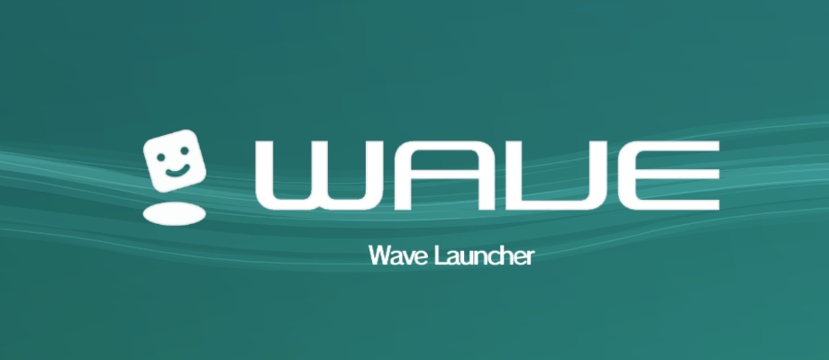
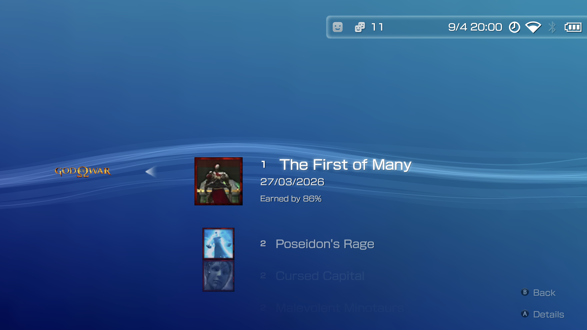
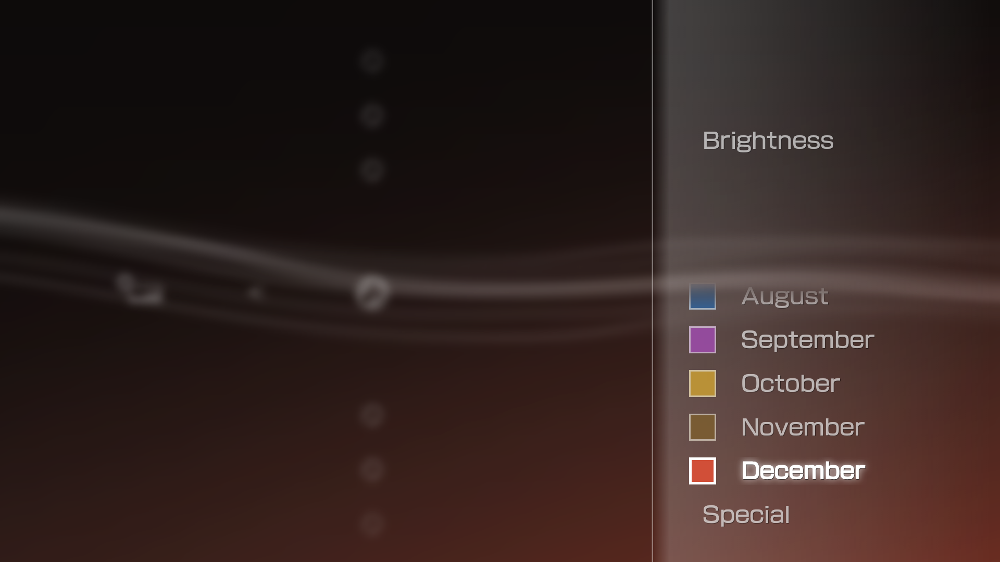

# Wave Launcher

**A controller-first Android launcher inspired by the PlayStation 3 XrossMediaBar.**

---

## About

Wave Launcher is an Android-based interface built around the design of the XrossMediaBar (XMB/PS3). It supports personal game libraries, rich metadata scraping, trophy tracking and controller-friendly multimedia playback.

> [!NOTE]
> Wave Launcher is a **frontend**, not an emulator. Install and configure the emulators you want to use separately.

## Showcase

<table>
  <tr>
    <td align="center" width="50%">
      
       <strong>Home & Libraries</strong>
       Start with a clean library, then make Wave Launcher your own with collections, favorites, playtime, and personalized layouts.
    </td>
    <td align="center" width="50%">
      
       <strong>Metadata Scraping</strong>
       Give every game more character with artwork, descriptions, covers, sounds, and details from multiple sources.
    </td>
  </tr>
  <tr>
    <td align="center">
      
       <strong>Achievements</strong>
       Keep your progress close at hand and turn every session into another step toward your next achievement.
    </td>
    <td align="center">
      
       <strong>Customization</strong>
       Shape the look and feel of your launcher with custom wallpapers, colors, fonts, sounds, and interface scale.
    </td>
  </tr>
  <tr>
    <td align="center">
      
       <strong>Settings</strong>
       Fine-tune your setup, connect your libraries, choose your integrations, and keep control of how Wave Launcher behaves.
    </td>
    <td align="center">
      
       <strong>Software Updater</strong>
       Keep Wave Launcher current, import supported software sources, and set up standard or dual-screen emulation packs from one place.
    </td>
  </tr>
  <tr>
    <td align="center" colspan="2">
      
       <strong>Media</strong>
       Enjoy your videos, music, and photos with controller-friendly playback that fits naturally into your launcher.
    </td>
  </tr>
</table>

## Install & Updates

Download the latest APK from the [Releases page](https://github.com/WaveLauncher/WaveLauncher/releases/latest) and install it on your Android device. For future updates, open **Settings 🠊 Software Update** in the app. The updater can check for and install new Wave Launcher releases, while also helping you import supported software sources and install or update emulators via your own Obtainium JSON or the RJNY Emulation Pack.

## Features

### Controller & Navigation

- XMB-style navigation designed around gamepads and touch.
- Support for PlayStation, Xbox, Nintendo, and virtual controllers.
- Controller-specific prompts, customizable button layouts, AB / XY swapping, and a gamepad-friendly on-screen keyboard.
- On-Screen Controller for devices that do not have a physical controller.

### Game Libraries

- Organize platforms, collections, favorites, recently played games, and playtime.
- Storage labels, icons, hot-swap support, and external-storage autorun.inf support.
- Per-platform and per-game emulator assignments.

### Scraping & Achievements

- Game Metadata scraping through services including [SteamGridDB](https://www.steamgriddb.com/), [ScreenScraper](https://www.screenscraper.fr/), [RetroAchievements](https://retroachievements.org/), [Hasheous](https://hasheous.org/), Google Play, and Web Search.
- Multi-language scraper support.
- RetroAchievements and Dusklight (TwilitRealm) achievement tracking.

### Media & Customization

- Controller-friendly video, music, and photo playback.
- Background music, coldboot sounds, and separate volume controls.
- Wallpaper styles, color customization, brightness controls, and custom fonts.
- Interface scaling, text sizing, status bar options, boot logos, and custom UI sounds.

### Device Integration

- Dual-screen layouts with per-screen orientation, app placement, screen swapping, and docked mode.
- Android app discovery with clear separation between games, emulators, and apps.
- Encrypted FTPS file sharing for moving files to and from a device.
- HTTPS Wave Portal for managing supported launcher content from a browser (experimental).
- Quick first-run setup, custom paths, and existing-file detection.

### Metadata Sources

[SteamGridDB](https://www.steamgriddb.com/) · [ScreenScraper](https://www.screenscraper.fr/) · [RetroAchievements](https://retroachievements.org/) · [Hasheous](https://hasheous.org/) · [Google Play](https://play.google.com/)

### Open Source Foundations

[FFmpeg](https://ffmpeg.org/) · [AndroidX](https://developer.android.com/jetpack/androidx) · [LGPL-2.1](https://www.gnu.org/licenses/old-licenses/lgpl-2.1.html) · [Apache License 2.0](https://www.apache.org/licenses/LICENSE-2.0)
